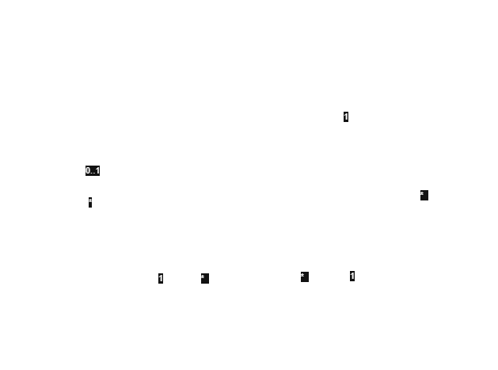

# Propuesta TP DSW

## Grupo
### Integrantes
* Leg 53084 - Moretti Yrure, Pedro
* Leg 52222 - Bernard, Bruno

### Repositorios
* [frontend app](https://github.com/bernardbruno/front-tp-dsw)
* [backend app](https://github.com/bernardbruno/back-tp-dsw)

## Tema
### Descripción
El sistema es una plataforma interactiva de predicciones de Fórmula 1 que permite a los usuarios anticipar los resultados de las carreras y competir entre sí. Cada participante puede registrar sus pronósticos sobre posiciones, pilotos, escuderías y otros aspectos del campeonato, obteniendo puntajes según la precisión de sus aciertos. Está orientado a brindar una experiencia dinámica que combine la emoción del automovilismo con el análisis y la competencia entre fanáticos.

### Modelo

## Alcance Funcional 

### Alcance Mínimo

Regularidad:
|Req|Detalle|
|:-|:-|
|CRUD simple|1. CRUD Escuderia  2. CRUD Circuito|
|CRUD dependiente|1. CRUD Piloto {depende de} CRUD Escuderia  |
|Listado + detalle|1. Listado de Pilotos => datos del piloto y su escudería asociada 2. Listado de Carreras => fecha, circuito, pilotos participantes y estado de la carrera|
|CUU/Epic|1. Gestionar la Carrera: editar el estado, asignar el circuito y CRUD resultado de los pilotos con su escudería|

## Adicionales para Aprobación

|Req|Detalle|
|:-|:-|
|CRUD |1. CRUD Escuderia  2. CRUD Circuito 3. CRUD Piloto 4. CRUD Carrera  5. CRUD Resultado  6. CRUD Prediccion  7. CRUD Torneo 8. CRUD Usuario|
|Listado + detalle|1. Listado de Pilotos => datos del piloto y su escudería asociada 2. Listado de Carreras => fecha, circuito, pilotos participantes y estado de la carrera 3. Listado de Usuarios con mejores Predicciones => datos del Usuario|
|CUU/Epic|1. Gestionar la Carrera: editar el estado, asignar el circuito y CRUD resultado de los pilotos con su escudería 2.  Registrar predicción de una carrera 3. Gestionar Torneo: definir un torneo con sus carreras y sus participantes|

### Alcance Adicional Voluntario

|Req|Detalle|
|:-|:-|
|CRUD|1. Post 2. Comentario |
|CUU/Epic|1. Realizar un post 2. Ingresar los resultados automáticamente mediante una API|
|Otros| - |
